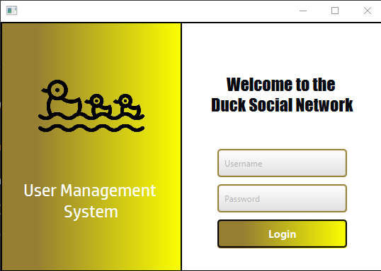

# DuckSocialNetwork

A desktop *social network* app (users can be a **Duck** or  a **Person**), built with **JavaFX** + **PostgreSQL**. The project includes authentication, user management, friendships/friend requests, chat with replies, events (including *race events* for ducks), and a notification system.

> Project: `DuckSocialNetwork` (Gradle) • UI: FXML + CSS • JavaFX 17


---


## Tech stack

- **Language:** Java
- **UI:** JavaFX 17 
- **Build tool:** Gradle
- **Database:** PostgreSQL
- **Testing:** JUnit 5


---


### Patterns / concepts used

- **MVC**
- **Repository pattern**
- **Observer pattern**
- **Factory pattern** 
- **DTOs** 

---


## How to run

### Requirements

- JDK 17
- A local PostgreSQL instance + schema/tables created

### Build & run (Gradle)

```cmd
gradlew.bat clean build
gradlew.bat run
```

---

## License

Educational / demo project. Choose a license (MIT / Apache-2.0) if you want the usage terms to be explicit.
